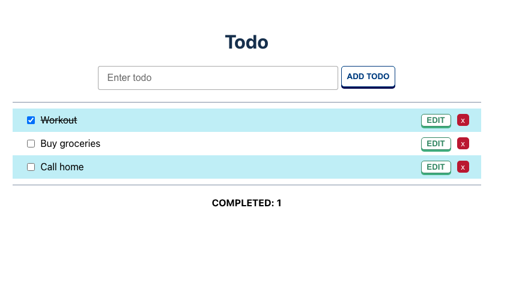

## Screenshots



## Installation and Setup Instructions

### Installation:

Clone repo.
`git clone https://github.com/mmtakeuchi/strong-todo`
`cd strong-todo`

Install dependencies in both client and server.

```
cd client
npm install or yarn install

cd ..
npm install or yarn install
```

### Setup MongoDB

Create a new file named `.env` to the root file.
Assign a new variable `MONGO_URI={YOUR_MONGO_URI_CODE}`

### To Start App:

`npm run dev`

### To Visit App:

`localhost:3000`

## Features

- Drag and Drop
- Toggle Task Description / Edit Task Field

## Features to Add

- Typescript Integration

## License

[MIT](https://choosealicense.com/licenses/mit/)
